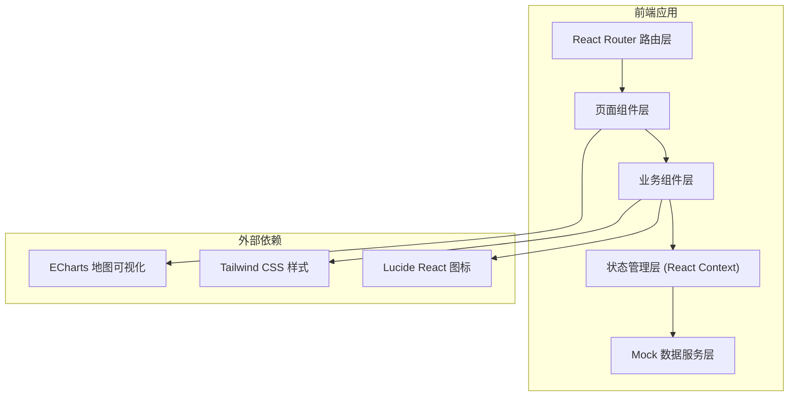

## 1. 架构设计



## 2. 技术描述

- **前端框架**：React 18 + TypeScript + Vite
- **构建工具**：Vite 5
- **样式方案**：Tailwind CSS 3
- **路由管理**：React Router v6
- **地图可视化**：ECharts 5 + 中国地图 GeoJSON
- **图标库**：Lucide React
- **数据**：前端 Mock 数据，模拟真实业务场景

## 3. 路由定义

| 路由路径 | 页面名称 | 用途说明 |
|----------|----------|----------|
| `/` | 风险地图首页 | 全国热力图、筛选条件、城市详情卡片、事件处置 |
| `/pending` | 待处理清单 | 多维排序事件列表、晨会确认 |
| `/review` | 复盘分析 | 高风险地区、问题词云、已降温事件、策略建议 |

## 4. 数据模型

### 4.1 核心数据结构

```typescript
// 风险等级枚举
enum RiskLevel {
  LOW = 'low',        // 低风险
  MEDIUM = 'medium',  // 中风险
  HIGH = 'high',      // 高风险
  CRITICAL = 'critical' // 极高风险
}

// 事件分类枚举
enum EventCategory {
  MISUNDERSTANDING = 'misunderstanding',  // 误解投诉
  QUALITY = 'quality',                    // 质量争议
  LABOR = 'labor',                        // 劳动纠纷
  REGULATORY = 'regulatory'               // 监管关注
}

// 情绪倾向枚举
enum Sentiment {
  NEGATIVE = 'negative',    // 负面
  MIXED = 'mixed',          // 混合
  NEUTRAL = 'neutral'       // 中性
}

// 媒体层级枚举
enum MediaTier {
  NATIONAL = 'national',    // 国家级媒体
  PROVINCIAL = 'provincial', // 省级媒体
  LOCAL = 'local',          // 本地媒体
  SOCIAL = 'social',        // 社交媒体
  KOL = 'kol'               // 自媒体/KOL
}

// 处置状态枚举
enum DisposalStatus {
  PENDING = 'pending',        // 待处理
  CONFIRMED = 'confirmed',    // 已确认
  PROCESSING = 'processing',  // 处理中
  COOLED = 'cooled',          // 已降温
  RESOLVED = 'resolved'       // 已解决
}

// 省份/城市风险数据
interface RegionRisk {
  regionCode: string;         // 地区编码
  regionName: string;         // 地区名称
  riskLevel: RiskLevel;       // 风险等级
  riskScore: number;          // 风险分值 0-100
  eventCount: number;         // 事件数量
  highRiskCount: number;      // 高风险事件数
}

// 舆情事件
interface PublicOpinionEvent {
  id: string;                 // 事件ID
  title: string;              // 事件标题
  city: string;               // 所属城市
  province: string;           // 所属省份
  riskLevel: RiskLevel;       // 风险等级
  category?: EventCategory;   // 事件分类
  sentiment: Sentiment;       // 情绪倾向
  firstPlatform: string;      // 首发平台
  firstPublishTime: Date;     // 首发时间
  repostPeak: number;         // 转发峰值
  spreadSpeed: number;        // 扩散速度指数 0-100
  localMediaInvolvement: number; // 本地媒体参与度 0-100
  mediaTier: MediaTier;       // 最高媒体层级
  mainTopics: string[];       // 主要话题
  typicalContent: string;     // 典型原文摘要
  status: DisposalStatus;     // 处置状态
  assignee?: string;          // 责任人
  confirmedAt?: Date;         // 晨会确认时间
  resolvedAt?: Date;          // 解决时间
  coolDownHours?: number;     // 降温时长（小时）
}

// 高频问题词
interface HotWord {
  word: string;               // 词汇
  count: number;              // 出现频次
  trend: 'up' | 'down' | 'stable'; // 趋势
}

// 策略建议
interface StrategySuggestion {
  id: string;
  type: 'unified_response' | 'regional_intervention'; // 建议类型
  priority: 'high' | 'medium' | 'low';
  title: string;
  description: string;
  relatedRegions: string[];
  relatedEvents: string[];
}
```

### 4.2 数据 Mock 策略

- 生成 34 个省级行政区的风险数据
- 生成 50-80 个典型舆情事件，覆盖不同风险等级、分类、地区
- 生成 20-30 个高频问题词
- 生成 5-8 条策略建议
- 数据支持按品牌、时间、类型过滤
